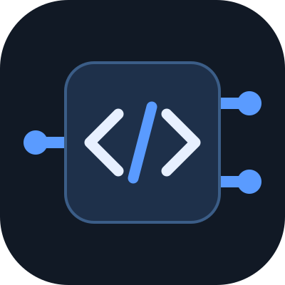
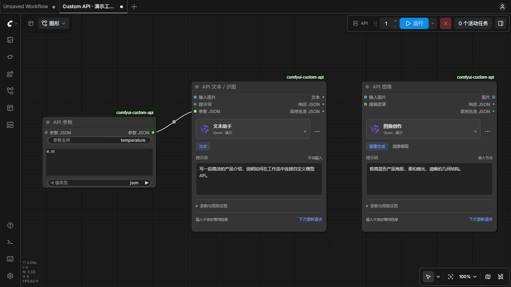
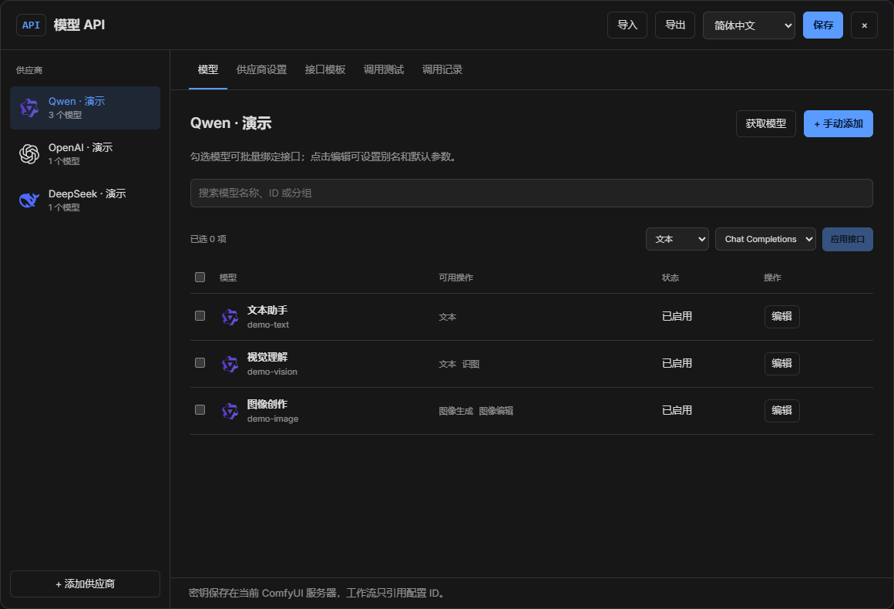
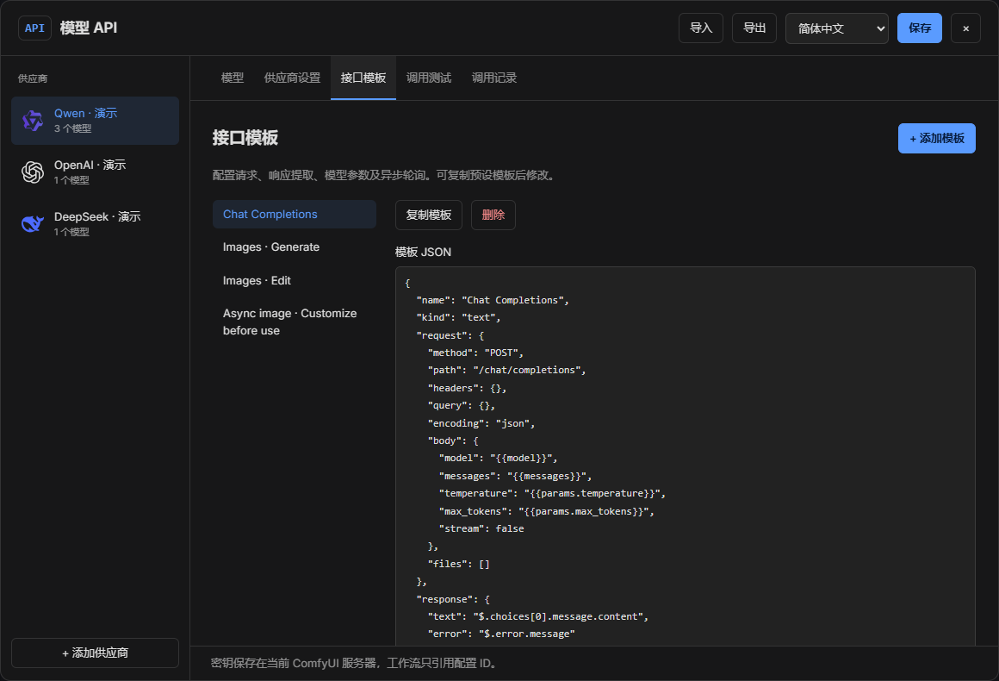
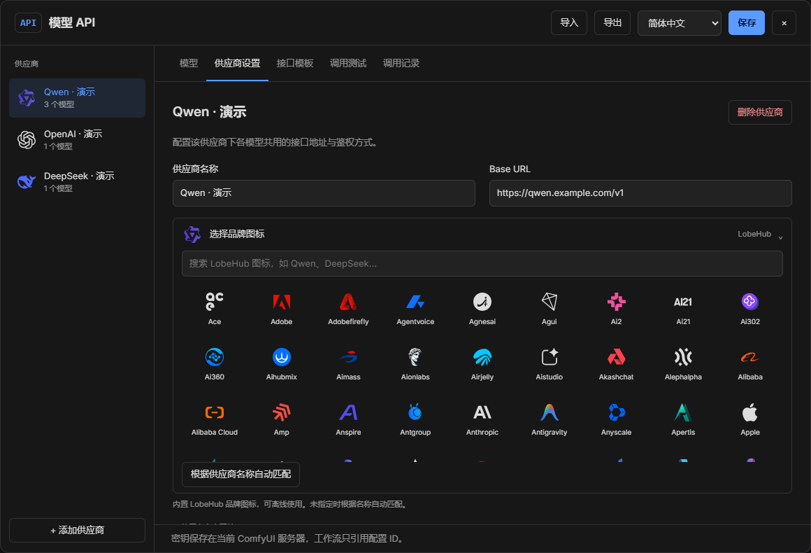

<p align="center">
  
</p>

<h1 align="center">ComfyUI Custom API</h1>

<p align="center">把自己的模型 API，接进 ComfyUI 工作流。</p>

<p align="center">
  <a href="https://github.com/Einzieg/ComfyUI-custom-api/releases"></a>
  <a href="https://github.com/Einzieg/ComfyUI-custom-api/actions/workflows/test.yml"></a>
  <a href="LICENSE"></a>
  <a href="https://registry.comfy.org/nodes/comfyui-custom-api"></a>
</p>

<p align="center">
  简体中文 · <a href="docs/README.en.md">English</a> · <a href="#安装">安装</a> · <a href="docs/templates.md">请求模板</a> · <a href="https://github.com/Einzieg/ComfyUI-custom-api/issues">问题反馈</a>
</p>

通过顶部管理面板配置供应商、发现模型、编辑请求格式，再用节点完成**文本、识图、生图和图片编辑**。支持简体中文 / English，调用 API 无需下载本地模型权重。



<p align="center"><sub>真实 ComfyUI 界面，使用本地演示配置。截图中的品牌和模型名称不代表供应商兼容性认证。</sub></p>

## 功能

| 能力 | 可以做什么 |
|---|---|
| **供应商管理** | 自定义名称、LobeHub 图标、Base URL、API Key、鉴权方式、超时与并发 |
| **模型管理** | 自动发现或手动添加；统一搜索；别名、分组及批量操作模板绑定 |
| **自定义请求** | JSON、表单、multipart；自定义路径、Header、Query、变量和响应提取 |
| **工作流节点** | 文本 / 识图、图像生成 / 编辑、可串联的 JSON 参数节点 |
| **任务与缓存** | 异步任务轮询、停止等待、结果复用和“下次重新请求” |
| **本地配置** | 密钥与配置分开保存；工作流和导出配置不包含已存密钥 |

### 模型管理

在一个面板中管理多个供应商，搜索模型并为支持的操作绑定模板。内置 **322 个 LobeHub 品牌图标**，随插件本地加载。



<details>
<summary><strong>查看请求模板编辑器和图标选择器</strong></summary>

按供应商文档修改请求和响应映射，预览后再发起调用。



通过搜索选择品牌图标，也可以根据供应商名称自动匹配。



</details>

## 安装

### 在自定义节点管理器中查找

搜索 **`comfyui-custom-api`** 或 **`ComfyUI Custom API`**。

- [Comfy Registry](https://registry.comfy.org/nodes/comfyui-custom-api)：已发布，官方搜索接口已返回该插件。`0.2.0` 当前仍处于平台审核状态。
- 旧版 Manager 默认目录：[收录 PR #3258](https://github.com/Comfy-Org/ComfyUI-Manager/pull/3258) 等待合并。

若目录尚未刷新或暂时无法安装，可使用下面的 Git / ZIP 方式。[查看收录状态与发布说明 →](docs/publishing.md)

### 从 GitHub 安装

在**实际运行的 ComfyUI** 的 `custom_nodes` 目录打开 PowerShell 7：

```powershell
$ErrorActionPreference = 'Stop'
git clone https://github.com/Einzieg/ComfyUI-custom-api.git
if ($LASTEXITCODE -ne 0) { throw '插件下载失败' }
```

也可以下载 [最新 Release ZIP](https://github.com/Einzieg/ComfyUI-custom-api/releases/latest)，将其中的 `ComfyUI-custom-api` 文件夹放进 `custom_nodes`。

随后使用 **ComfyUI 自己的 Python 环境** 安装依赖，重启 ComfyUI 并刷新浏览器。下面的路径需替换为你的实际路径：

```powershell
$ErrorActionPreference = 'Stop'
& 'D:\ComfyUI\venv\Scripts\python.exe' -m pip install -r 'D:\ComfyUI\custom_nodes\ComfyUI-custom-api\requirements.txt'
if ($LASTEXITCODE -ne 0) { throw '依赖安装失败' }
```

Windows 便携包通常使用 `python_embeded\python.exe`。已验证环境：ComfyUI **0.35.0** / 前端 **1.51.10** / Python **3.13.12**，CPU 模式。

## 第一次使用

1. **添加供应商**：点击顶栏 **API**，或主菜单 **Extensions → 模型 API**，填写 Base URL 和鉴权信息。
2. **获取模型**：点击“保存并获取模型”，或手动添加模型 ID。
3. **绑定模板**：为模型支持的操作选择模板；非标准接口可复制模板后编辑。
4. **开始使用**：添加 API 节点，在顶部模型选择器中选好模型，输入提示词并运行。

| 操作 | 常见模板起点 |
|---|---|
| 文本、识图 | `Chat Completions` |
| 图像生成 | `Images · Generate` |
| 图片编辑 | `Images · Edit` |
| 自定义异步任务 | 异步任务模板，需按供应商文档修改 |

**自动发现只获取模型列表，不会猜测模型能力。** 新模型需要绑定模板后才会出现在对应节点的选择器中。可先在“调用测试”里预览请求；实际调用可能产生供应商费用。

## 三种节点

| 节点 | 用途 | 输出 |
|---|---|---|
| **API 文本 / 识图** | 提示词、系统提示词，可选图片 | 文本、脱敏响应 JSON、调用信息 |
| **API 图像** | 生图、图片编辑，可选图片和遮罩 | IMAGE 列表、脱敏响应 JSON、调用信息 |
| **API 参数** | 按类型组合参数，可串联 | 参数 JSON |

图像可直接连接 `PreviewImage`、`SaveImage`；不同尺寸的多张图片保留原始尺寸。提示词、系统提示词和参数旁的“接入节点”可显示连线插槽。

高级设置默认折叠。点击“下次重新请求”只更新请求编号，下次运行工作流时才发送请求；生成请求失败后不会自动重试。

## 常见问题

<details>
<summary><strong>为什么获取到的模型没有出现在节点里？</strong></summary>

请编辑模型，给当前节点需要的操作绑定模板，例如“文本”或“图像生成”。模型选择器只显示支持当前节点操作的模型。

</details>

<details>
<summary><strong>API Key 保存在哪里？</strong></summary>

默认保存在 ComfyUI 私有系统用户目录 `user/__custom_api/secrets.json`，也可从指定环境变量读取。文件是受本地权限保护的明文存储。配置按 ComfyUI 实例共享，不提供多租户隔离。详见[配置与密钥](docs/usage.md#配置与密钥)。

</details>

<details>
<summary><strong>为什么参数没有发送给供应商？</strong></summary>

只有模板引用的参数才会发送，例如 `{{params.temperature}}`。模型默认值覆盖模板默认值，节点参数覆盖模型默认值。[查看模板示例](docs/templates.md)。

</details>

<details>
<summary><strong>支持哪些语言和接口？</strong></summary>

界面可选择“跟随 ComfyUI / 简体中文 / English”。支持常见 HTTP JSON / 表单 / multipart 接口及异步轮询。当前不包含视频、音频、流式文本、任意脚本、cURL 导入和多步骤第三方存储上传。

</details>

## 文档与开发

- [完整使用指南](docs/usage.md)：节点操作、参数、缓存、遮罩、语言和密钥。
- [请求模板说明](docs/templates.md)：变量、请求格式和响应提取示例。
- [验证记录](docs/validation.md)：**33 项后端测试 + 6 项前端测试**，以及真实 ComfyUI 工作流验证。
- [发布与收录](docs/publishing.md)：Registry、Manager 和维护者发布流程。

开发需要 Python、PyTorch、`pytest`、`requirements.txt` 中的依赖，以及 Node.js 22+。运行 `python -m pytest -q` 和 `node --test tests/frontend.test.mjs` 执行测试；`scripts/package.py` 构建安装包，需要 Python 3.11+。测试使用本地模拟供应商，不会调用收费模型。

欢迎通过 [Issues](https://github.com/Einzieg/ComfyUI-custom-api/issues) 提交问题，或通过 Pull Request 补充翻译与请求模板。反馈时请移除 API Key 和私人配置。

## 许可与致谢

本项目及原创项目图标采用 [MIT License](LICENSE)。感谢 [ComfyUI](https://github.com/Comfy-Org/ComfyUI) 和 [LobeHub Icons](https://icons.lobehub.com/)。供应商品牌图标来自官方 `@lobehub/icons-static-svg@1.95.0`，保留其 MIT 许可；[图标来源](docs/icons.md) · [截图与素材说明](docs/assets/README.md)。
